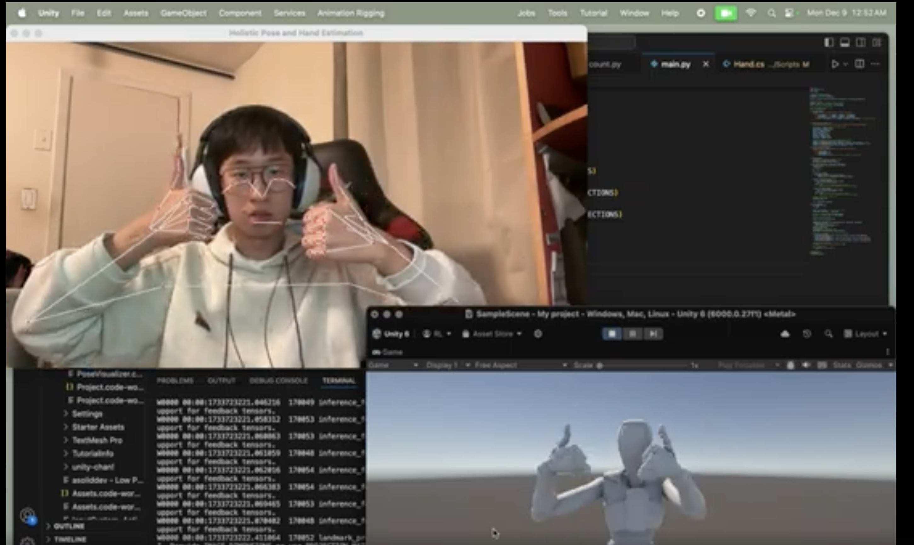

# Mediapipe Unity Project

This project integrates Mediapipe with Unity, allowing the combination of powerful computer vision tools and Unity's rendering capabilities.



[Watch the video](https://youtu.be/zdNzt8IEyJA)

## Guide to Running Unity and Python Scripts with Mediapipe

### Step 1: Clone the Repository

1. Open a terminal or command prompt.
2. Clone the repository by running the following command:
   ```bash
   git clone https://github.com/Riyuanliu/medipipeUnityProject.git
   ```
3. Navigate to the Python directory:
   ```bash
   cd medipipeUnityProject/python
   ```

### Step 2: Install Necessary Python Packages

1. Ensure you have Python installed on your system. It's recommended to use Python 3.7 or later.
2. Install the required packages by running:
   ```bash
   pip install mediapipe opencv-python
   ```

### Step 3: Download and Install Unity

1. Download Unity from the [official Unity website](https://unity.com/).
2. Install Unity Hub and then install a version of Unity compatible with the project (check the Unity version used in the repository or select the latest stable version).
3. Once installed, open Unity Hub and log in with your Unity account.

### Step 4: Open the Unity Project

1. Launch Unity Hub.
2. Add the project to Unity Hub:
   - Click on **"Add"** in Unity Hub.
   - Navigate to the `unity` directory within the cloned repository and select it.
3. Open the Unity project from Unity Hub.

### Step 5: Install Required Unity Libraries

1. When opening the project for the first time, Unity may prompt you to install missing libraries or packages.
2. Follow the prompts to install any required packages.

### Step 6: Set Up the Unity Scene

1. If the Unity editor doesn’t display anything upon opening the project:
   - In the Unity Editor, open the `Assets` folder.
   - Locate the `SampleScene` file.
   - Drag and drop the `SampleScene` into the **"Hierarchy"** window or double-click on it to load the scene.
2. Save your scene once loaded.

### Step 7: Running the Project

#### Python Script:

1. In the terminal, navigate to the `python` folder of the project (if you aren’t already there):
   ```bash
   cd medipipeUnityProject/python
   ```
2. Run your Python script:
   ```bash
   python main.py
   ```

#### Unity Project:

1. Click the **"Play"** button in the Unity editor to start the Unity project.
2. Ensure the Unity application and Python script communicate as intended (if there’s integration).

---

## Troubleshooting

### Missing Packages in Unity

- Open the **“Package Manager”** from Unity (**Window > Package Manager**).
- Search for and install any missing packages.

### Python Errors

- Double-check the Python package installation.
- Verify the version compatibility of Mediapipe and OpenCV with your Python version.

### Unity Scene Not Loading

- Ensure you’ve dragged the `SampleScene` into the hierarchy.
- Confirm that all assets are properly imported.

---

Feel free to update this guide based on your specific setup or any changes in the project.

# Mediapipe Unity Project

This project integrates Mediapipe with Unity, allowing the combination of powerful computer vision tools and Unity's rendering capabilities.

## Guide to Running Unity and Python Scripts with Mediapipe

### Step 1: Clone the Repository

1. Open a terminal or command prompt.
2. Clone the repository by running the following command:
   ```bash
   git clone https://github.com/Riyuanliu/medipipeUnityProject.git
   ```
3. Navigate to the Python directory:
   ```bash
   cd medipipeUnityProject/python
   ```

### Step 2: Install Necessary Python Packages

1. Ensure you have Python installed on your system. It's recommended to use Python 3.7 or later.
2. Install the required packages by running:
   ```bash
   pip install mediapipe opencv-python
   ```

### Step 3: Download and Install Unity

1. Download Unity from the [official Unity website](https://unity.com/).
2. Install Unity Hub and then install a version of Unity compatible with the project (check the Unity version used in the repository or select the latest stable version).
3. Once installed, open Unity Hub and log in with your Unity account.

### Step 4: Open the Unity Project

1. Launch Unity Hub.
2. Add the project to Unity Hub:
   - Click on **"Add"** in Unity Hub.
   - Navigate to the `unity` directory within the cloned repository and select it.
3. Open the Unity project from Unity Hub.

### Step 5: Install Required Unity Libraries

1. When opening the project for the first time, Unity may prompt you to install missing libraries or packages.
2. Follow the prompts to install any required packages.

### Step 6: Set Up the Unity Scene

1. If the Unity editor doesn’t display anything upon opening the project:
   - In the Unity Editor, open the `Assets` folder.
   - Locate the `SampleScene` file.
   - Drag and drop the `SampleScene` into the **"Hierarchy"** window or double-click on it to load the scene.
2. Save your scene once loaded.

### Step 7: Running the Project

#### Python Script:

1. In the terminal, navigate to the `python` folder of the project (if you aren’t already there):
   ```bash
   cd medipipeUnityProject/python
   ```
2. Run your Python script:
   ```bash
   python main.py
   ```

#### Unity Project:

1. Click the **"Play"** button in the Unity editor to start the Unity project.
2. Ensure the Unity application and Python script communicate as intended (if there’s integration).

---

## Troubleshooting

### Missing Packages in Unity

- Open the **“Package Manager”** from Unity (**Window > Package Manager**).
- Search for and install any missing packages.

### Python Errors

- Double-check the Python package installation.
- Verify the version compatibility of Mediapipe and OpenCV with your Python version.

### Unity Scene Not Loading

- Ensure you’ve dragged the `SampleScene` into the hierarchy.
- Confirm that all assets are properly imported.

---

Feel free to update this guide based on your specific setup or any changes in the project.
